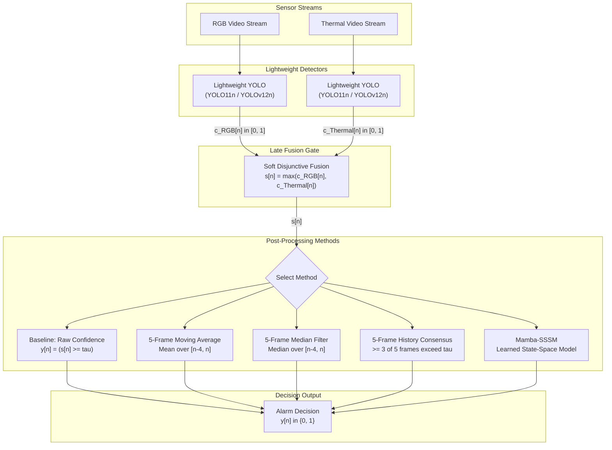

<h1 align="center">Title Is In Progress</h1>

<p align="center">
  <a href="LICENSE"></a>
  
  
</p>

## Table of Contents

- [Overview](#overview)
- [Pipeline Architecture](#pipeline-architecture)
- [Research](#research)
  - [Research Question](#research-question)
  - [Contribution](#contribution)
  - [Methodology](#methodology)
  - [Multimodal Fusion Formulation](#multimodal-fusion-formulation)
  - [Post-Processing Methods](#post-processing-methods)
  - [Dataset](#dataset)
  - [Experiments](#experiments)
  - [Results](#results)
- [Quick Reproduction](#quick-reproduction)
- [Repository Organization](#repository-organization)
- [Authors & Citation](#authors--citation)
- [Acknowledgments & License](#acknowledgments--license)

## Overview

> [!NOTE]
> This paper is work in progress, It is planned for submission to the ICSPIS 2026 (14 September 2026)

## Pipeline Architecture



## Research

### Research Question

How do different post-processing methods compare in reducing false alarms while maintaining reliable positive detections in lightweight object detection systems operating on synthetic multimodal search-and-rescue video data?

### Contribution

This work contributes the following:

1. **A synthetic multimodal search-and-rescue video dataset** containing RGB and thermal video across desert, forest, and snow/altitude conditions, with positive, hard-negative, and clear-negative scenarios.
2. **A multimodal object detection benchmark** using lightweight YOLO models to evaluate person detection across the generated RGB and thermal data.
3. **A comparative evaluation of post-processing methods** for converting frame-level object detections into reliable alarm decisions, with emphasis on reducing false alarms.
4. **An analysis of false-alarm reduction versus positive-detection reliability**, examining how different post-processing methods affect alarm generation rather than relying solely on frame-level detection metrics.
5. **An evaluation of the practical implications of false detections** for downstream operations in autonomous search-and-rescue systems, including unnecessary bandwidth use and IoT operations.

### Methodology

**Models**

Two primary YOLO-family lightweight object detection models are used:

1. **YOLO11n** - Ultralytics' nano YOLO11 variant; optimized for real-time/edge speed and efficiency.
2. **YOLOv12n** - nano attention-centric YOLOv12; uses Area Attention + R-ELAN for higher accuracy at similar speed.

| Model | Params | GFLOPs |
| --- | --- | --- |
| YOLO11n | TBD | TBD |
| YOLOv12n | TBD | TBD |

> [!NOTE]
> The main contribution here is not a comparison of different YOLO models.

| Training Setting | Value |
| --- | --- |
| **Batch size** | 32 |
| **Epochs** | 100 |
| **Early stopping** | Disabled |
| **Hardware GPU** | Nvidia RTX 4060 |
| **VRAM** | 8 GB |

### Multimodal Fusion Formulation

Continuous confidences $c_{\text{RGB}}[n] \in [0.0, 1.0]$ and $c_{\text{Thermal}}[n] \in [0.0, 1.0]$ are produced per frame for the class `Person_Detected`.

To preserve true detections when one modality is compromised without multiplying miss rates, a soft disjunctive (OR) late fusion via max-pooling is applied:

$$s[n] = \max\big(c_{\text{RGB}}[n], \, c_{\text{Thermal}}[n]\big)$$

This continuous value $s[n]$ feeds directly into downstream post-processing before binary alarm assertion.

### Post-Processing Methods

| Category | Method | Requires Training? |
| --- | --- | --- |
| **Binary detections** | Baseline | ❌ No |
|  | 5-Frame History Tracking | ❌ No |
| **Confidence signals** | 5-Frame Moving Average | ❌ No |
| **Signal processing** | 5-Frame Median Filter | ❌ No |
| **Learned temporal representations / State-space models** | Mamba-SSSM | ✅ Yes |

#### Baseline

No history tracking or temporal filtering is applied. If the fused confidence score meets or exceeds the threshold $\tau$, an alarm is generated:

$$y[n] = \begin{cases} 1, & s[n] \ge \tau \\ 0, & \text{otherwise} \end{cases}$$

#### 5-Frame History Tracking

A temporal consensus is calculated over the current frame and previous four frames. An alarm is generated when the cue meets or exceeds threshold $\tau$ in at least three of the five frames:

$$y[n] = \begin{cases} 1, & \displaystyle\sum_{k=0}^{4} \mathbb{I}(s[n-k] \ge \tau) \ge 3 \\ 0, & \text{otherwise} \end{cases}$$

#### 5-Frame Moving Average

A continuous rolling average over a 5-frame window:

$$\tilde{s}[n] = \frac{1}{5} \sum_{k=0}^{4} s[n-k]$$

$$y[n] = \begin{cases} 1, & \tilde{s}[n] \ge \tau \\ 0, & \text{otherwise} \end{cases}$$

#### 5-Frame Median Filter

Order-statistic median calculation over the current and previous four frames to reject isolated single-frame impulse spikes:

$$\tilde{s}[n] = \text{median}\big(s[n], s[n-1], s[n-2], s[n-3], s[n-4]\big)$$

$$y[n] = \begin{cases} 1, & \tilde{s}[n] \ge \tau \\ 0, & \text{otherwise} \end{cases}$$

#### Mamba-SSSM

A learned state-space sequence model operating across the temporal sequence of confidence values to output alarm decisions.

### Dataset

**1. Dataset Creation**
The dataset was synthetically generated using Google Gemini's video generation capabilities, creating two distinct modalities: RGB, and Thermal. Dataset is manually generated by one primary author using several prompts, the prompts are available in the `DATASET_PROMPTS.md` file.

**2. Annotation Strategy**
RGB dataset is manually annotated by one primary annotator in Label Studio with zero or one bounding box denoting the class "Person_Detected". Annotations for thermal were created by leveraging the bounding box annotations from the RGB videos and copying them directly to the corresponding Thermal sequences.

**3. Dataset Split**
The dataset is divided into three conditions, each containing three scenario types:

* **Conditions:** Desert, Forest, and Altitude (Snow).
* **Scenario Types:** Positive (target), Hard-Negative (challenging but not target), and Clear-Negative (easy negatives). Ratio: 5:3:2

**4. Dataset Structure**
Each video snippet is 10 seconds long. The dataset is split into training, validation, and testing sets with no overlap between the sets.

The following table summarizes the dataset composition:

| Condition | Scenario Type | RGB Videos | Thermal Videos |
| --- | --- | --- | --- |
| Desert | Positive | 5 | 5 |
| Desert | Hard-negative | 3 | 3 |
| Desert | Clear-negative | 2 | 2 |
| Forest | Positive | 5 | 5 |
| Forest | Hard-negative | 3 | 3 |
| Forest | Clear-negative | 2 | 2 |
| Altitude (Snow) | Positive | 5 | 5 |
| Altitude (Snow) | Hard-negative | 3 | 3 |
| Altitude (Snow) | Clear-negative | 2 | 2 |
| **Total** |  | **30** | **30** |

#### Properties

The following tables summarize the video data properties:

| Video Property | Value |
| --- | --- |
| **Length** | 00:00:10 |
| **Frame width** | 1280 px |
| **Frame height** | 720 px |
| **Frame rate** | 24.00 frames/second |

| Image Property | Value |
| --- | --- |
| **Bit depth** | 24-bit (8-bit/channel RGB) |
| **Size** | 640 × 640 pixels |
| **Sampling rate** | 8 frames per second |
| **Crop coordinates (X)** | [320, 960] px (centered) |
| **Crop coordinates (Y)** | [80, 720] px (bottom) |
| **Compression** | H.264 |

### Results

*Results table will be populated upon completion of model training and evaluation runs.*

| Post-Processing Method | Model | Precision | Recall | False Alarm Rate |
| --- | --- | --- | --- | --- |
| Baseline | YOLO11n | TBD | TBD | TBD |
| 5-Frame History Tracking | YOLO11n | TBD | TBD | TBD |
| 5-Frame Moving Average | YOLO11n | TBD | TBD | TBD |
| 5-Frame Median Filter | YOLO11n | TBD | TBD | TBD |
| Mamba-SSSM | YOLO11n | TBD | TBD | TBD |
| Baseline | YOLOv12n | TBD | TBD | TBD |
| 5-Frame History Tracking | YOLOv12n | TBD | TBD | TBD |
| 5-Frame Moving Average | YOLOv12n | TBD | TBD | TBD |
| 5-Frame Median Filter | YOLOv12n | TBD | TBD | TBD |
| Mamba-SSSM | YOLOv12n | TBD | TBD | TBD |

## Quick Reproduction

TBD

## Repository Organization

TBD

## Authors & Citation

* **Oumar Mamoun Ibrahim** — Department of Computer Engineering, University of Sharjah


[U22200741@sharjah.ac.ae](https://www.google.com/search?q=mailto%3AU22200741%40sharjah.ac.ae) · [ORCID 0009-0008-0312-1605](https://orcid.org/0009-0008-0312-1605)
* **Dr. Mohamad Khairi bin Ishak** — Department of Computer Engineering, University of Sharjah


[mishak@sharjah.ac.ae](https://www.google.com/search?q=mailto%3Amishak%40sharjah.ac.ae) · [ORCID 0000-0002-3554-0061](https://orcid.org/0000-0002-3554-0061)

For the conference manuscript itself, use:

```bibtex
@unpublished{ibrahim2026multimodal,
  title     = {Title Is In Progress},
  author    = {Ibrahim, Oumar Mamoun and bin Ishak, Mohamad Khairi},
  year      = {2026},
}

```

## Acknowledgments & License

This work builds on [Ultralytics YOLO](https://github.com/ultralytics/ultralytics), [Label Studio](https://github.com/HumanSignal/label-studio). Code is licensed under [Apache License 2.0](https://www.google.com/search?q=LICENSE); third-party dependencies retain their own licenses.

```

```