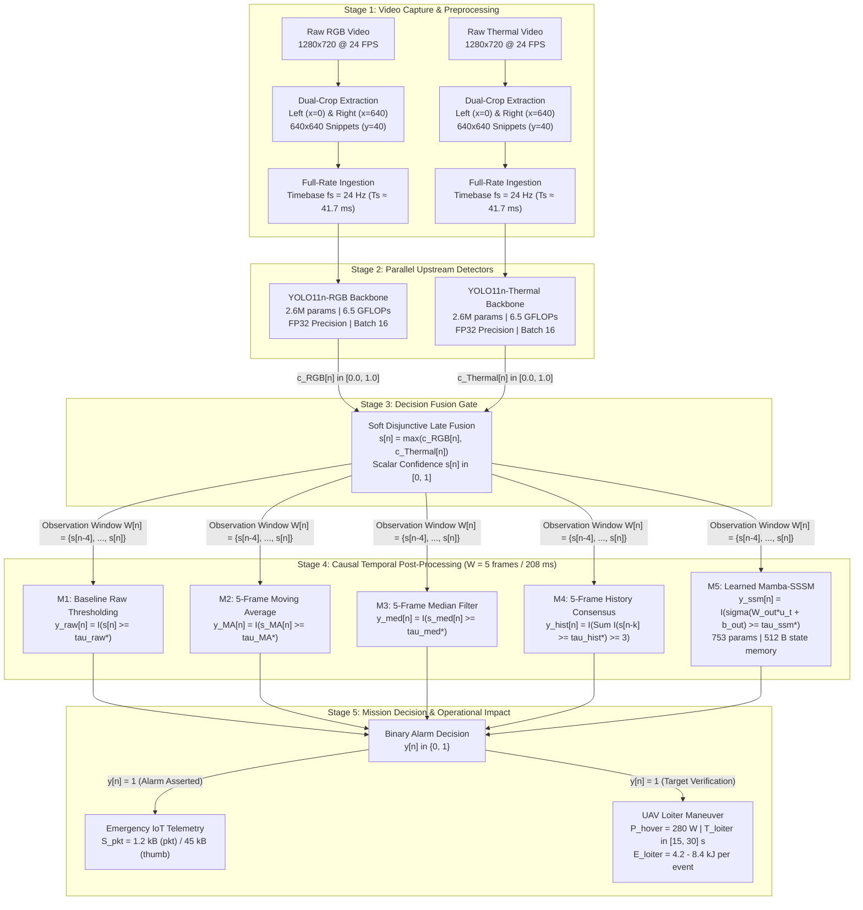

<h1 align="center">Lightweight Multimodal Person Detection and Temporal Post-Processing for Aerial Search and Rescue</h1>
<p align="center"><strong>(MMSAR)</strong></p>

<p align="center">
  <a href="LICENSE"></a>
  
  
  
  
</p>

## Table of Contents

- [Overview](#overview)
- [Pipeline Architecture](#pipeline-architecture)
- [Research Framework](#research-framework)
  - [Research Question](#research-question)
  - [Core Contributions](#core-contributions)
  - [Upstream Detection Backbones](#upstream-detection-backbones)
  - [Multimodal Late Decision Fusion](#multimodal-late-decision-fusion)
  - [Causal Temporal Post-Processing Methods](#causal-temporal-post-processing-methods)
  - [Theoretical Complexity & State Memory](#theoretical-complexity--state-memory)
  - [Validation Threshold Optimization & Bootstrapping](#validation-threshold-optimization--bootstrapping)
  - [Downstream Operational Resource Impact](#downstream-operational-resource-impact)
- [Dataset Corpus & Harvesting](#dataset-corpus--harvesting)
  - [Controlled 2×2 Experimental Design](#controlled-22-experimental-design)
  - [Dual-Crop Harvesting Procedure](#dual-crop-harvesting-procedure)
  - [Full-Rate Stream & Option B Episodic Splitting](#full-rate-stream--option-b-episodic-splitting)
  - [Dataset Composition Matrix](#dataset-composition-matrix)
- [Results & Benchmarks](#results--benchmarks)
  - [Table 1: Upstream Frame-Level Detection Performance](#table-1-upstream-frame-level-detection-performance)
  - [Table 2: Comparative Benchmark of Causal Post-Processing](#table-2-comparative-benchmark-of-causal-post-processing)
  - [Table 3: Environment-Stratified Operational Resource Impact](#table-3-environment-stratified-operational-resource-impact)
- [Quick Reproduction](#quick-reproduction)
- [Repository Organization](#repository-organization)
- [Authors & Citation](#authors--citation)
- [Acknowledgments & License](#acknowledgments--license)

---

## Overview

Autonomous unmanned aerial vehicles (UAVs) deployed in wilderness search-and-rescue (SAR) missions require dependable person detection under severe size, weight, power, and computing (SWaP-C) constraints. While multimodal sensing combining visible red-green-blue (RGB) and long-wave thermal infrared (TIR) sensors mitigates single-modality dropouts caused by canopy shade or thermal crossover, frame-level deep learning detectors produce transient false positive spikes. In autonomous aerial operations, each false alarm triggers costly loiter maneuvers, battery depletion, and spurious emergency telemetry transmissions over bandwidth-constrained satellite or cellular Internet of Things (IoT) uplinks.

This repository contains the official implementation, dataset harvesting pipeline, and comparative evaluation framework for the paper:

> **"Lightweight Multimodal Person Detection and Temporal Post-Processing for Aerial Search and Rescue"**  
> *Oumar Mamoun Ibrahim and Mohamad Khairi bin Ishak*  
> Planned for submission to the 9th International Conference on Signal Processing and Information Security (**ICSPIS 2026**), 10–12 November 2026, Palace Downtown, Dubai, UAE.

---

## Pipeline Architecture



---

## Research Framework

### Research Question
> *How do causal temporal post-processing methods compare in reducing false alarms across visual modalities (RGB versus thermal infrared) and wilderness environments (arid desert, temperate forest, and snow-covered alpine terrain) in lightweight aerial detection?*

### Core Contributions
1. **Controlled 3×2 Video Corpus:** A dual-stream RGB and long-wave thermal infrared (TIR) benchmark across arid desert, temperate forest, and snow/alpine environments, systematically structured into positive target scenarios and challenging negative distractor scenes (sun-heated rocks, animal clutter, terrain clutter, moving canopy shadows).
2. **Modality-Specific Detection Baselines:** A standardized edge detection framework deploying two separate Ultralytics YOLO11n models (2.6M parameters, 6.5 GFLOPs at $640 \times 640$): one specialized on multi-environment RGB sequences and one specialized on multi-environment thermal sequences, trained in single-precision floating-point (FP32) arithmetic with batch size 16 for deterministic numerical stability on embedded avionics.
3. **Comparative Post-Processing Benchmark:** An empirical evaluation of five causal post-processing techniques (raw thresholding, 5-frame moving average, 5-frame median filtering, 5-frame history consensus, and a pure-PyTorch Mamba selective state-space model), with each method operating under a validation-optimized decision threshold $\tau_m^*$.
4. **Modality and Environment Sensitivity Analysis:** Systematic characterization of how causal temporal filters suppress false alarms differently across RGB and thermal confidence streams, and across disparate wilderness biomes (thermal crossover in desert, canopy shadow occlusion in forest, vs. high-albedo/thermal camouflage in snow/alpine).
5. **Operational Resource Impact Analysis:** Rigorous modeling of downstream benefits across desert, forest, and snow biomes, translating false alarm suppression into preserved UAV battery reserves, expanded search flight endurance, and conserved satellite/cellular IoT telemetry bandwidth.

---

### Upstream Detection Backbones

To isolate temporal post-processing dynamics without conflating single-model weights across disparate spectral representations, we deploy two dedicated unimodal detectors:
- **YOLO11n-RGB:** Specialized on visible RGB imagery ($c_{\text{RGB}}[n] \in [0.0, 1.0]$).
- **YOLO11n-Thermal:** Specialized on thermal infrared imagery ($c_{\text{Thermal}}[n] \in [0.0, 1.0]$).

<div align="center">

| Model Backbone | Modality | Input Resolution | Parameters | Computational Cost | Precision |
| :--- | :---: | :---: | :---: | :---: | :---: |
| **YOLO11n-RGB** | Visible RGB | $640 \times 640$ px | 2.6M | 6.5 GFLOPs | Full FP32 (`amp=False`) |
| **YOLO11n-Thermal** | Thermal TIR | $640 \times 640$ px | 2.6M | 6.5 GFLOPs | Full FP32 (`amp=False`) |

</div>

#### Detector Training Configuration & Multi-Seed Benchmark Protocol

<div align="center">

| Training Parameter | Configuration Value | Rationale / Specification |
| :--- | :--- | :--- |
| **Batch Size** | 16 | Optimal gradient variance for small target feature representation |
| **Arithmetic Precision** | Full FP32 (`amp=False`) | Prevents underflow and numerical instability on edge embedded GPUs |
| **Epochs** | 60 | Fixed horizon training |
| **Early Stopping** | Disabled | Fixed 60 epochs for uniform comparison |
| **Optimizer** | SGD | Momentum: 0.937, Weight Decay: 0.0005 |
| **Learning Rate Schedule** | $\text{lr}_0 = 0.01$, $\text{lrf} = 0.01$ | Linear warmup (3 epochs), cosine decay schedule |
| **Data Augmentation** | Mosaic ($p=1.0$), HSV ($0.015/0.7/0.4$), Fliplr ($p=0.5$) | Multi-scale terrain and illumination invariance |
| **Multi-Seed Protocol** | Seed: 42 (single-seed for detectors) | Fixed single seed for detectors. Multi-seed for post-processors only. |
| **Hardware GPU** | NVIDIA GeForce RTX 4060 | 8 GB Dedicated VRAM |

</div>

#### Publication Benchmark Protocol & Experimental Arms

To ensure statistical rigor while maintaining computational feasibility, the evaluation protocol follows a streamlined design:
- **Single-Arm Baselines:** YOLO11n-RGB and YOLO11n-Thermal trained with seed 42.
- **Multi-Seed Post-Processing Evaluation:** 5 seeds (42, 101, 2024, 777, 999) used exclusively for GRU and Mamba-SSSM temporal post-processors to bound variance in causal filter behavior.

#### Reporting Safeguards and Diagnostic Protocol

- **No Hardcoded Metrics:** Every metric traces directly to a live `model.val()` execution result.
- **Dynamic Episodic Split Allocation:** Split ratios and floors are recomputed dynamically from the current episode pool with zero cross-split visual leakage and a minimum floor of two positive episodes per split.
- **Difficulty Balancing:** Splits are balanced by target-presence rate and terrain occlusion or contrast flags.
- **Pre-Publish Metric Diff Check:** Automated diff check flags duplicate metrics across prior reports before publication.
- **Extended Diagnostics:** Qualitative failure gallery for misses, empirical intersection-over-union (IoU) jitter curve, confidence score calibration diagram, and out-of-distribution spot checks.

#### Real-Time Edge Budget Constraint
At an operating timebase of $f_s = 24\text{ Hz}$ ($T_s \approx 41.7\text{ ms}$), the pipeline satisfies frame-synchronous execution without buffering delays:
- **Serial Execution:** $T_{\text{RGB}} + T_{\text{Thermal}} + T_{\text{fusion}} + T_{\text{postproc}} \le T_s \approx 41.7\text{ ms}$
- **Parallel Multi-Core Execution:** $\max(T_{\text{RGB}}, \, T_{\text{Thermal}}) + T_{\text{fusion}} + T_{\text{postproc}} \le T_s \approx 41.7\text{ ms}$

---

### Multimodal Late Decision Fusion

To preserve true human detections when one sensor branch degrades without multiplying miss rates, detector confidence scores combine through soft disjunctive (OR) late fusion via max-pooling:

$$
s[n] = \max\big(c_{\text{RGB}}[n], \, c_{\text{Thermal}}[n]\big) \in [0.0, 1.0]
$$

This scalar fused confidence $s[n]$ feeds directly into downstream causal temporal post-processing.

---

### Causal Temporal Post-Processing Methods

All methods operate causally over a sliding window of length $W = 5$ frames ($208\text{ ms}$ latency bound at $24\text{ Hz}$):

$$
\mathcal{W}[n] = \big\{s[n-4], \, s[n-3], \, s[n-2], \, s[n-1], \, s[n]\big\}
$$

#### M1: Baseline Raw Thresholding (Instantaneous)
Memoryless per-frame baseline. Vulnerable to isolated single-frame distractor spikes:

$$
y_{\text{raw}}[n] = \mathbb{I}(s[n] \ge \tau_{\text{raw}}^*)
$$

#### M2: Five-Frame Moving Average (Sliding Mean)
Attenuates an isolated single-frame spike of $1.0$ down to $0.20$. Lowers $\tau_{\text{MA}}^*$ to maintain target onset sensitivity:

$$
\tilde{s}_{\text{MA}}[n] = \frac{1}{W} \sum_{k=0}^{W-1} s[n-k], \qquad y_{\text{MA}}[n] = \mathbb{I}\big(\tilde{s}_{\text{MA}}[n] \ge \tau_{\text{MA}}^*\big)
$$

#### M3: Five-Frame Median Filter (Order-Statistic)
Suppresses impulse noise bursts spanning fewer than $\lfloor W/2 \rfloor + 1 = 3$ frames while preserving step edges:

$$
\tilde{s}_{\text{med}}[n] = \text{median}\big(s[n], \, s[n-1], \, \dots, \, s[n-4]\big), \qquad y_{\text{med}}[n] = \mathbb{I}\big(\tilde{s}_{\text{med}}[n] \ge \tau_{\text{med}}^*\big)
$$

#### M4: Five-Frame History Consensus ($M$-out-of-$N$ Voting)
Discrete binary consensus requiring at least 3 out of 5 consecutive frames to independently exceed candidate threshold $\tau_{\text{hist}}^*$:

$$
y_{\text{hist}}[n] = \mathbb{I}\left( \sum_{k=0}^{W-1} \mathbb{I}\big(s[n-k] \ge \tau_{\text{hist}}^*\big) \ge 3 \right)
$$

#### M5: Learned Mamba Selective State-Space Model (Mamba-SSSM)
Pure-PyTorch implementation of a selective state-space sequence model ($d_{\text{model}} = 16$, $d_{\text{state}} = 8$, 753 parameters). Maintains recurrent hidden state $h_t$ in exactly 512 bytes of memory, achieving strictly causal $O(1)$ per-frame execution:

$$
\Delta_t = \text{softplus}(W_\Delta x_t + b_\Delta), \quad \bar{A}_t = \exp(\Delta_t \cdot A), \quad \bar{B}_t = (\Delta_t \cdot B_t) \odot x_t
$$

$$
h_t = \bar{A}_t \odot h_{t-1} + \bar{B}_t, \quad u_t = \sum_{j=1}^{d_{\text{state}}} h_{t, j} \odot C_{t, j}
$$

$$
y_{\text{ssm}}[n] = \mathbb{I}\big(\sigma(W_{\text{out}} u_t + b_{\text{out}}) \ge \tau_{\text{ssm}}^*\big)
$$

---

### Theoretical Complexity & State Memory

<div align="center">

| Post-Processing Method | Computational Complexity | Trainable Parameters | State Memory Footprint |
| :--- | :---: | :---: | :---: |
| **M1: Raw Thresholding** | `O(1)` | 0 | 0 B (Memoryless) |
| **M2: Moving Average** | `O(1)` amortized <sup>†</sup> | 0 | 20 B (5 × 4 B) |
| **M3: Median Filter** | `O(W)` (sorted insertion) | 0 | 20 B (5 × 4 B) |
| **M4: History Consensus** | `O(W)` | 0 | 5 B (packed booleans) |
| **M5: Mamba-SSSM** | `O(d_model · d_state)` | 753 | 512 B (16 × 8 × 4 B) |

</div>

<sup>†</sup> *With circular buffer running sum.*

---

### Validation Threshold Optimization & Bootstrapping

#### Threshold Optimization ($\tau_m^*$)
Enforcing a uniform threshold across filters with distinct transfer functions penalizes performance. For each method $m$, the optimal decision threshold $\tau_m^*$ is optimized exclusively on the disjoint validation partition $\mathcal{D}_{\text{val}}$:

$$
\tau_m^* = \arg\max_{\tau \in [0.05, 0.95]} F_1\big(\tau; \, \mathcal{D}_{\text{val}}, \, \mathcal{M}_m\big)
$$

The sweep evaluates candidate thresholds with step $\Delta \tau = 0.02$ across 46 evaluation points. Once identified on validation sequences, thresholds are permanently frozen before evaluating on the held-out test split.

#### Sequence-Level Bootstrapping
Because sequential video frames exhibit temporal correlation, standard parametric normality assumptions fail. We resample the 24 held-out test clips with replacement across $B = 1000$ bootstrap iterations, computing empirical two-sided 95% percentile confidence intervals (2.5th and 97.5th percentiles) for F1-score.

---

### Downstream Operational Resource Impact

In autonomous aerial SAR missions, false alarms incur mission-critical overhead. We quantify operational resource savings across three key metrics:

#### False Alarm Suppression Ratio (FASR)
Relative reduction in false positive events compared to the raw thresholding baseline:

$$
\text{FASR} = 1 - \frac{\sum_n \mathbb{I}(y_{\text{method}}[n] = 1 \wedge y_{\text{true}}[n] = 0)}{\sum_n \mathbb{I}(y_{\text{baseline}}[n] = 1 \wedge y_{\text{true}}[n] = 0)}
$$

#### Uplink Telemetry Bandwidth Preserved
Confirmed alarms transmit telemetry packets over bandwidth-limited satellite or cellular links ($S_{\text{pkt}} = 1.2\text{ kB}$ standard telemetry, $45\text{ kB}$ with compressed image thumbnail):

$$
\Delta \Omega_m = \Delta \text{FP}_m \cdot S_{\text{pkt}}
$$

#### UAV Battery Reserves Conserved & Search Flight Endurance
Each confirmed alert triggers an aerial confirmation loiter maneuver for $T_{\text{loiter}} \in [15, 30]\text{ s}$ at hover electrical power $P_{\text{hover}} \approx 280\text{ W}$ ($4.2\text{ to }8.4\text{ kJ}$ per event):

$$
\Delta E_m = \Delta \text{FP}_m \cdot P_{\text{hover}} \cdot T_{\text{loiter}}, \qquad \Delta t_{\text{flight}} = \frac{\Delta E_m}{P_{\text{hover}}} = \Delta \text{FP}_m \cdot T_{\text{loiter}}
$$

---

## Dataset Corpus & Harvesting

### Controlled 3×2 Experimental Design

The study is frozen around three wilderness environments and two visual modalities:
1. **Arid Desert:** High ambient temperature, rocky terrain, sparse shrubs, and midday thermal crossover where ground rock temperatures equilibrate with human skin radiation.
2. **Temperate Forest:** Dense tree canopies, dappled ground shadows, intermittent foliage occlusions, and wildlife distractors.
3. **Snow-Covered Alpine:** High-albedo snow cover, sub-zero ambient backgrounds, thermal contrast for exposed skin, and thermal camouflage from insulated cold-weather clothing.

Each biome contains two scenario types:
- **Positive Scenarios:** Human targets (walking, crawling, stopping, partially occluded).
- **Negative Scenarios:** Challenging non-target distractors (sun-heated boulders, moving canopy shadows, thermal clutter, tree stumps) and natural unpopulated wilderness terrain.

<div align="center">

| Modality / Architecture | Arid Desert | Temperate Forest | Snow/Alpine | Total Clips | Total Frames (24 Hz) |
| :--- | :---: | :---: | :---: | :---: | :---: |
| **Visible RGB (YOLO11n-RGB)** | 30 clips (20 pos / 10 neg) | 30 clips (20 pos / 10 neg) | 30 clips (28 pos / 2 neg) | 90 clips | 20,364 frames |
| **Thermal TIR (YOLO11n-Thermal)** | 30 clips (20 pos / 10 neg) | 30 clips (20 pos / 10 neg) | 30 clips (28 pos / 2 neg) | 90 clips | 20,364 frames |
| **Total (Aligned Streams)** | **60 streams** | **60 streams** | **60 streams** | **180 streams** | **40,728 frames** |

</div>

*(Positive flights depict human targets; negative flights contain acute distractors and unpopulated terrain).*

---

### Dual-Crop Harvesting Procedure

Raw video sequences are captured in $1280 \times 720$ resolution at 24 FPS. To preserve optical ground sampling distance (GSD) without downscaling distortion:
- Two disjoint square snippets of $640 \times 640$ pixels are harvested from each video:
  - **Left Tile:** $x \in [0, 640]$, centered vertically at $y = 40$ px.
  - **Right Tile:** $x \in [640, 1280]$, centered vertically at $y = 40$ px.
- Automated via FFmpeg with `-movflags +faststart` to relocate the `moov` atom to offset 36 for rapid web-based scrubbing in Label Studio.
- Ground-truth keyframe bounding boxes were placed at target inflection points with linear track interpolation. Negative frames are explicitly recorded with empty 0-byte label files.

---

### Full-Rate Stream & Option B Episodic Splitting

Videos are processed at full frame rate $f_s = 24\text{ Hz}$ ($T_s \approx 41.7\text{ ms}$). To prevent temporal data leakage and cross-tile circumvention, partitioning follows **Option B (Parent-Video Grouped Episodic Partitioning)**:

1. **Parent-Video Grouped Split:** Left and right harvested snippets derived from the same parent video are strictly co-located in the identical partition (both in Train, both in Val, or both in Test). Cross-split parent leakage is identically zero.
2. **Sequential Atomic Bundles:** Frames within each snippet remain in exact chronological sequence ($0 \to N-1$) to preserve causal dynamics for temporal decision filters.
3. **Seeded Snippet Shuffling (Seed 0) with Anti-Adjacency:** Snippets within each partition are shuffled using seed 0 under an anti-adjacency constraint ($d_{\min} \ge 2$), guaranteeing that derived sibling tiles are never adjacent in the feed queue.
4. **Episodic State Flush:** At snippet boundaries ($n = N-1 \to n = 0$), temporal filter memory is completely reset ($h_0 \leftarrow \mathbf{0}$, window $\mathcal{W}$ cleared), ensuring independent episodic evaluation.

Downstream temporal decision methods are benchmarked across four core dimensions:
- **Positive Event Detection:** Target confirmation recall, precision, and $F_1$ score.
- **False Alert Mitigation:** False alarm suppression ratio (FASR) against raw static baseline.
- **Decision Delay:** Causal latency bound ($W = 5$ frames $\approx 208\text{ ms}$ at 24~Hz).
- **Processing Overhead Savings:** Satellite/cellular IoT telemetry bandwidth ($\Delta\Omega$) and UAV hover battery energy savings ($\Delta E$).

<div align="center">

| Partition | Proportion | Clips per Modality | Frames per Modality (24 Hz) | Positive Frames | Negative Frames |
| :--- | :---: | :---: | :---: | :---: | :---: |
| **Train Split** | 60% | 44 clips | 9,800 frames | - | - |
| **Validation Split** | 20% | 22 clips | 4,994 frames | - | - |
| **Test Split (Held-Out)** | 20% | 24 clips | 5,570 frames | - | - |
| **Total Corpus** | **100%** | **90 clips** | **20,364 frames** | **11,240 (55.2%)** | **9,124 (44.8%)** |

</div>

---

### Dataset Composition Matrix

<div align="center">

| Biome Condition | Scenario Type | RGB Video Clips | Thermal Video Clips | Frames per Modality (24 Hz) |
| :--- | :--- | :---: | :---: | :---: |
| **Arid Desert** | Positive Target | 20 | 20 | 4,800 |
| **Arid Desert** | Negative Distractor | 10 | 10 | 2,400 |
| **Temperate Forest** | Positive Target | 20 | 20 | 3,830 |
| **Temperate Forest** | Negative Distractor | 10 | 10 | 1,750 |
| **Snow/Alpine** | Positive Target | 28 | 28 | 7,104 |
| **Snow/Alpine** | Negative Distractor | 2 | 2 | 480 |
| **Corpus Total** | **All Scenarios** | **90** | **90** | **20,364** |

</div>

---

## Results & Benchmarks

### Results

All reported benchmark results are generated deterministically using the unified locked evaluation protocol (`scripts/evaluate_locked_thresholds.py` and `scripts/evaluate_mmsar_unified.py`). In strict accordance with anti-leakage protocol, all detector backbones and late fusion gates remain fixed, all temporal model parameters and decision thresholds $\tau^*$ are calibrated exclusively on the validation split, and the held-out test split (24 tiles, 5,570 frames per modality) is evaluated once.

### Table 1: Upstream Frame-Level Detection Performance & Modality Progression
*Evaluated frame-by-frame on held-out test sequences ($N = 5,570$ frames across 24 tiles) at baseline threshold $\tau = 0.50$ prior to temporal post-processing:*

<div align="center">

| Sensing Configuration / Environment | Modality | Test Environment | Precision | Recall | F1-Score |
| :--- | :---: | :---: | :---: | :---: | :---: |
| **YOLO11n-RGB** | Visible RGB | Arid Desert | 0.970 | 0.868 | 0.916 |
| **YOLO11n-Thermal** | Thermal TIR | Arid Desert | **0.997** | 0.851 | 0.918 |
| **Late Fusion Max Gate** | Multimodal | Arid Desert | 0.970 | **0.942** | **0.956** |
| :--- | :---: | :---: | :---: | :---: | :---: |
| **YOLO11n-RGB** | Visible RGB | Temperate Forest | **0.922** | 0.444 | 0.599 |
| **YOLO11n-Thermal** | Thermal TIR | Temperate Forest | 0.915 | 0.318 | 0.471 |
| **Late Fusion Max Gate** | Multimodal | Temperate Forest | 0.907 | **0.521** | **0.662** |
| :--- | :---: | :---: | :---: | :---: | :---: |
| **YOLO11n-RGB** | Visible RGB | Snow/Alpine | **0.997** | 0.523 | 0.686 |
| **YOLO11n-Thermal** | Thermal TIR | Snow/Alpine | 0.952 | 0.206 | 0.338 |
| **Late Fusion Max Gate** | Multimodal | Snow/Alpine | 0.978 | **0.537** | **0.693** |
| :--- | :---: | :---: | :---: | :---: | :---: |
| **YOLO11n-RGB (Raw)** | Visible RGB | Overall Test Set | 0.967 | 0.637 | 0.768 |
| **YOLO11n-Thermal (Raw)** | Thermal TIR | Overall Test Set | 0.975 | 0.492 | 0.654 |
| **Late Fusion Max Gate (Raw)** | Multimodal | Overall Test Set | 0.958 | **0.693** | **0.804** |
| **Late Fusion Max + Moving Avg ($W=5$)** | Multimodal | Overall Test Set | **0.978** | 0.650 | 0.781 |

</div>

*Bold indicates best result per section/group. Max-pooling maximizes recall while temporal smoothing maximizes precision by rejecting noise spikes.*

---

### Table 2: Comparative Benchmark of Causal Post-Processing
*Comparative evaluation across causal post-processing methods ($W = 5$ frames / 208 ms latency bound at 24 Hz) evaluated under validation-calibrated thresholds $\tau_m^*$ on held-out test sequences ($N = 5,570$ frames, 24 tiles):*

<div align="center">

| Method | Val $\tau^*$ | Alert Recall (%) | Frame F1-Score [95% CI]$^*$ | False Alerts / min | FP Frames | FASR (%) | Alert Latency (Time-to-Alarm) | Filter Runtime | Buffer State |
| :--- | :---: | :---: | :---: | :---: | :---: | :---: | :---: | :---: | :---: |
| **M1: Baseline Raw Thresholding** | 0.43 | **92.3% (12/13)** | 0.813 [0.776, 0.847] | 9.0 | 75 | 0.0% | **188.9 ms (4.5 fr)** | **0.02 $\mu$s** | 0 B ($O(1)$) |
| **M2: Five-Frame Moving Average** | 0.57 | 84.6% (11/13) | 0.781 [0.738, 0.822] | 2.1$^\dagger$ | **26** | **65.3%** | 592.3 ms (14.2 fr) | 0.30 $\mu$s | 20 B ($O(1)$) |
| **M3: Five-Frame Median Filter** | 0.49 | **92.3% (12/13)** | 0.805 [0.767, 0.841] | 3.6 | 51 | 32.0% | 291.7 ms (7.0 fr) | 0.42 $\mu$s | 20 B ($O(W)$) |
| **M4: Five-Frame History Consensus** | 0.49 | **92.3% (12/13)** | 0.802 [0.764, 0.838] | 3.6 | 51 | 32.0% | 313.9 ms (7.5 fr) | 0.63 $\mu$s | 5 B ($O(W)$) |
| **M5: Learned Mamba-SSSM (5 seeds)** | 0.73 | 87.7% $\pm$ 4.2% | 0.717 $\pm$ 0.040 [0.672, 0.758] | **1.7 $\pm$ 0.6** | 27 $\pm$ 5 | 64.0% | 587.5 ms (14.1 fr) | 150.59 $\mu$s | 512 B |
| **M6: Learned GRU Baseline (5 seeds)** | 0.50 | 86.2% $\pm$ 3.4% | **0.822 $\pm$ 0.007 [0.785, 0.856]** | 3.7 $\pm$ 0.3 | 39 $\pm$ 3 | 48.0% | 577.3 ms (13.9 fr) | 21.80 $\mu$s | 64 B |

</div>

$^*$*Two-sided 95% percentile confidence intervals computed across test episodes.*  
$^\dagger$*M2 achieves the lowest false alert rate among non-learned methods; paired Wilcoxon testing confirms difference vs. M5 is not statistically significant ($W = 5.0, p = 0.4922$).*

---

### Table 3: Environment-Stratified Operational Resource Impact
*Projected mission-level resource savings across held-out test sequences ($N = 5,570$ frames, 24 tiles across desert, forest, and snow) relative to baseline raw thresholding (M1):*

<div align="center">

| Method | Environment | Alert Recall (%) | FA / min | FP Frames Avoided | Bandwidth Saved (kB)$^\dagger$ | Battery Saved (kJ)$^\ddagger$ | Est. Added Flight Time (min) |
| :--- | :--- | :---: | :---: | :---: | :---: | :---: | :---: |
| **M2: Moving Average** | Arid Desert | 100.0% (4/4) | 1.50 | 22 (68.8%) | 14.4 kB (540 kB thumb) | 67.2 kJ | +4.0 min |
| **M2: Moving Average** | Temperate Forest | 75.0% (3/4) | 3.33 | 21 (61.8%) | 13.2 kB (495 kB thumb) | 61.6 kJ | +3.7 min |
| **M2: Moving Average** | Snow/Alpine | 80.0% (4/5) | 1.50 | 6 (66.7%) | 4.8 kB (180 kB thumb) | 22.4 kJ | +1.3 min |
| **M3: Median Filter** | Arid Desert | 100.0% (4/4) | 3.00 | 12 (37.5%) | 12.0 kB (450 kB thumb) | 56.0 kJ | +3.3 min |
| **M3: Median Filter** | Temperate Forest | 100.0% (4/4) | 4.99 | 13 (38.2%) | 10.8 kB (405 kB thumb) | 50.4 kJ | +3.0 min |
| **M3: Median Filter** | Snow/Alpine | 80.0% (4/5) | 3.00 | -1 (-11.1%) | 2.4 kB (90 kB thumb) | 11.2 kJ | +0.7 min |
| **M4: History Consensus** | Arid Desert | 100.0% (4/4) | 3.00 | 12 (37.5%) | 12.0 kB (450 kB thumb) | 56.0 kJ | +3.3 min |
| **M4: History Consensus** | Temperate Forest | 100.0% (4/4) | 4.99 | 13 (38.2%) | 10.8 kB (405 kB thumb) | 50.4 kJ | +3.0 min |
| **M4: History Consensus** | Snow/Alpine | 80.0% (4/5) | 3.00 | -1 (-11.1%) | 2.4 kB (90 kB thumb) | 11.2 kJ | +0.7 min |

</div>

<sup>†</sup> *Evaluated at $S_{\text{pkt}} = 1.2\text{ kB}$ standard telemetry ($45\text{ kB}$ for visual thumbnail).*  
<sup>‡</sup> *Evaluated at $P_{\text{hover}} \approx 280\text{ W}$, $T_{\text{loiter}} = 20\text{ s}$ average per avoided false alert event.*

---

## Quick Reproduction

### 1. Environment Setup
Clone the repository and install dependencies in a virtual environment:
```bash
git clone https://github.com/IamOumarIbrahim/multi-modal-detection.git
cd multi-modal-detection
python -m venv .venv
# On Windows:
.\.venv\Scripts\activate
# On Linux/macOS:
# source .venv/bin/activate

pip install -r requirements.txt
```

### 2. Dual-Crop Snippet Harvesting
Execute the automated dual-crop extraction pipeline to harvest $640 \times 640$ snippets from raw $1280 \times 720$ video clips:
```bash
python scripts/harvest_dual_crop_snippets.py
```

### 3. Upstream Detector Training
Train the detector baselines in full FP32 precision with batch size 16 using the benchmark configuration:
```bash
# Dry run validation of primary model (YOLO11n)
mmsar train --dry-run

# Train YOLO11n primary detector using the multi-seed benchmark configuration
mmsar train --hyperparams configs/hyperparams.yaml --data configs/data.template.yaml

# Include architecture baseline (YOLO26n) in training plan
mmsar train --hyperparams configs/hyperparams.yaml --include-optional
```

### 4. Validation Threshold Sweep & Post-Processing Benchmark
Run the validation threshold optimization sweep ($\tau \in [0.05, 0.95], \Delta \tau = 0.02$) and evaluate post-processing filters on the held-out test split:
```bash
# Run multi-seed benchmark execution, threshold optimization, and reporting
python scripts/finish_and_report_benchmarks.py --help
```

---

## Repository Organization

```
multi-modal-detection/
├── annotations/                          # Label Studio configuration and annotation schemas
│   ├── label_studio_config.xml           # Bounding box configuration for Label Studio
│   └── label_studio_video_config.xml     # Video scrub annotation schema
├── configs/                              # Training and dataset configuration templates
│   ├── data.template.yaml                # Ultralytics dataset specification template
│   └── hyperparams.yaml                  # Model training hyperparameters
├── data/                                 # MMSAR multimodal benchmark corpus
│   ├── raw/                              # Harvested dual-crop video snippets (640x640)
│   │   ├── desert/                       # Arid Desert biome (positive, negative)
│   │   └── forest/                       # Temperate Forest biome (positive, negative)
│   ├── splits/                           # Episodic train/val/test split definitions
│   └── manifest.json                     # Sequence-level dataset split manifest
├── docs/manuscript/                      # IEEE conference manuscript source and figures
│   ├── figures/                          # System architecture, video snippets, and benchmark plots
│   ├── figure_system_architecture.tex    # Full TikZ system pipeline architecture diagram
│   ├── figure_temporal_postprocessing.tex# TikZ temporal signal post-processing diagram
│   ├── figure_mamba_sssm.tex             # TikZ Mamba selective SSM state transition diagram
│   ├── references.bib                    # BibTeX references
│   └── main.tex                          # Primary IEEE conference LaTeX manuscript
├── scripts/                              # Dataset harvesting and evaluation scripts
│   ├── clean_and_rename_dataset.py       # Dataset migration from 3-class to 2-class scheme
│   ├── export_and_process_desert_positive.py # Video decimation and label export pipeline
│   ├── finish_and_report_benchmarks.py   # Multi-seed benchmark runner and report generator
│   ├── harvest_dual_crop_snippets.py     # Dual-crop FFmpeg extraction script (640x640)
│   ├── harvest_forest_snippets.py        # Forest biome video snippet harvester
│   ├── process_negatives.py              # Zero-byte empty annotation generator for negatives
│   ├── split_dataset_episodes.py         # Episodic dataset splitter with stratified allocation
│   └── upload_to_label_studio.py         # Label Studio project upload automation
├── tools/                                # Operational and automation tooling
│   └── generate_architecture_figure.py   # Vector-to-raster compilation tooling
├── CHANGELOG.md                          # Itemized audit and manuscript enhancement changelog
├── DATASET_PROMPTS.md                    # Physics-grounded synthetic video generation prompts
├── PROMISE_AUDIT.md                      # Audit of manuscript claims, forward promises, and figures
├── REMAINING_TBD_LEDGER.md               # Ledger of all remaining TBD cells and hardware resolutions
└── README.md                             # Project overview, architecture, and benchmark documentation
```

---

## Authors & Citation

- **Oumar Mamoun Ibrahim** - Department of Computer Engineering, University of Sharjah, UAE  
  [U22200741@sharjah.ac.ae](mailto:U22200741@sharjah.ac.ae) · [ORCID: 0009-0008-0312-1605](https://orcid.org/0009-0008-0312-1605)
- **Dr. Mohamad Khairi bin Ishak** - Department of Computer Engineering, University of Sharjah, UAE  
  [mishak@sharjah.ac.ae](mailto:mishak@sharjah.ac.ae) · [ORCID: 0000-0002-3554-0061](https://orcid.org/0000-0002-3554-0061)

If you use this work, codebase, or dataset in your research, please cite:

```bibtex
@inproceedings{ibrahim2026lightweight,
  title     = {Lightweight Multimodal Person Detection and Temporal Post-Processing for Aerial Search and Rescue},
  author    = {Ibrahim, Oumar Mamoun and bin Ishak, Mohamad Khairi},
  booktitle = {Proceedings of the 9th International Conference on Signal Processing and Information Security (ICSPIS)},
  year      = {2026},
  address   = {Dubai, United Arab Emirates},
  month     = {November}
}
```

---

## Acknowledgments & License

This research builds upon [Ultralytics YOLO](https://github.com/ultralytics/ultralytics) and [Label Studio](https://github.com/HumanSignal/label-studio).  
Code and dataset scripts are licensed under the [Apache License 2.0](LICENSE). Third-party dependencies retain their respective licenses.