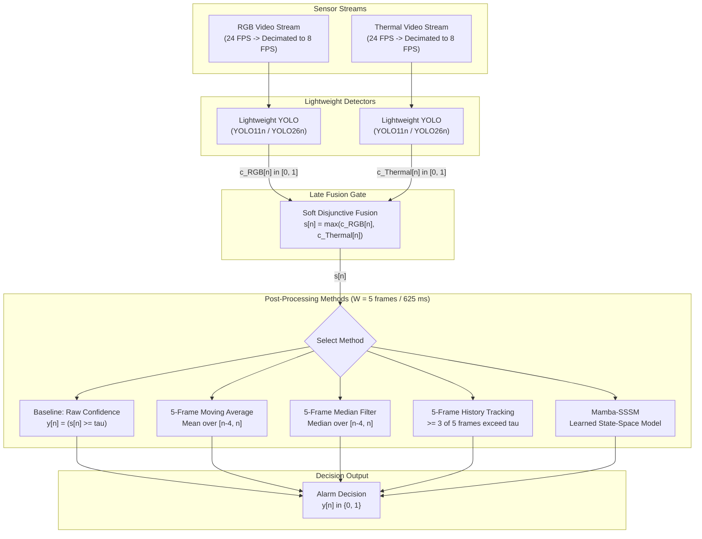

<h1 align="center">Title Is In Progress</h1>
<!-- TODO: Replace placeholder title above (and in the BibTeX entry below) with the final paper title before submission. -->

<p align="center">
  <a href="LICENSE"></a>
  
  
</p>

## Table of Contents

- [Overview](#overview)
- [Pipeline Architecture](#pipeline-architecture)
- [Research](#research)
  - [Research Question](#research-question)
  - [Contribution](#contribution)
  - [Methodology](#methodology)
  - [Multimodal Fusion Formulation](#multimodal-fusion-formulation)
  - [Post-Processing Methods](#post-processing-methods)
  - [Dataset](#dataset)
  - [Results](#results)
- [Quick Reproduction](#quick-reproduction)
- [Repository Organization](#repository-organization)
- [Authors & Citation](#authors--citation)
- [Acknowledgments & License](#acknowledgments--license)

## Overview

> [!NOTE]
> This paper is a work in progress. It is planned for submission to ICSPIS 2026 (submission deadline: 14 September 2026).

## Pipeline Architecture



## Research

### Research Question
How do different post-processing methods compare in reducing false alarms while maintaining reliable positive detections in lightweight object detection systems operating on synthetic multimodal search-and-rescue video data?

### Contribution

This work contributes the following:

1. **A synthetic multimodal search-and-rescue video dataset** containing RGB and thermal video across desert, forest, and snow/altitude conditions, with positive, hard-negative, and clear-negative scenarios.

2. **A multimodal object detection benchmark** using lightweight YOLO models to evaluate person detection across the generated RGB and thermal data.

3. **A comparative evaluation of post-processing methods** for converting frame-level object detections into reliable alarm decisions, with emphasis on reducing false alarms.

4. **An analysis of false-alarm reduction versus positive-detection reliability**, examining how different post-processing methods affect alarm generation rather than relying solely on frame-level detection metrics.

5. **An evaluation of the practical implications of false detections** for downstream operations in autonomous search-and-rescue systems, including unnecessary bandwidth use and IoT operations.

### Methodology

**Models**

Two primary YOLO-family lightweight object detection models are used:
1. **YOLO11n** - Ultralytics' nano YOLO11 variant; optimized for real-time/edge speed and efficiency.
2. **YOLO26n** - Ultralytics' nano YOLO26 variant; uses an end-to-end architecture for real-time edge speed and efficiency.

<div align="center">

| Model | Params | GFLOPs |
| :--- | :---: | :---: |
| YOLO11n | TBD | TBD |
| YOLO26n | TBD | TBD |

</div>

> [!NOTE]
> The main contribution here is not a comparison of different YOLO models.

<div align="center">

| Training Setting | Value |
| :--- | :--- |
| **Batch size** | 32 |
| **Epochs** | 100 |
| **Early stopping** | Disabled |
| **Hardware GPU** | Nvidia RTX 4060 |
| **VRAM** | 8 GB |

</div>

### Multimodal Fusion Formulation

Continuous confidences $c_{\text{RGB}}[n] \in [0.0, 1.0]$ and $c_{\text{Thermal}}[n] \in [0.0, 1.0]$ are produced per frame for the class `Person_Detected` at a sampling rate of $f_s = 8\text{ Hz}$ ($T_s = 125\text{ ms}$).

To preserve true detections when one modality is compromised without multiplying miss rates, a soft disjunctive (OR) late fusion via max-pooling is applied:

$$s[n] = \max\big(c_{\text{RGB}}[n], \, c_{\text{Thermal}}[n]\big)$$

This continuous value $s[n]$ feeds directly into downstream post-processing before binary alarm assertion.

### Post-Processing Methods

<div align="center">

| Category | Method | Requires Training? |
| --- | --- | --- |
| **Binary detections** | Baseline | ❌ No |
|  | 5-Frame History Tracking | ❌ No |
| **Continuous confidence filtering** | 5-Frame Moving Average | ❌ No |
|  | 5-Frame Median Filter | ❌ No |
| **Learned temporal representations / State-space models** | Mamba-SSSM | ✅ Yes |
</div>

#### Baseline
No history tracking or temporal filtering is applied. If the fused confidence score meets or exceeds the threshold $\tau$, an alarm is generated:

$$y[n] = \begin{cases} 1, & s[n] \ge \tau \\ 0, & \text{otherwise} \end{cases}$$

#### 5-Frame History Tracking
A temporal consensus is calculated over the current frame and previous four frames (spanning 5 frames / 625 ms). An alarm is generated when the cue meets or exceeds threshold $\tau$ in at least three of the five frames:

$$y[n] = \begin{cases} 1, & \displaystyle\sum_{k=0}^{4} \mathbb{I}(s[n-k] \ge \tau) \ge 3 \\ 0, & \text{otherwise} \end{cases}$$

#### 5-Frame Moving Average
A continuous rolling average over a 5-frame window ($625\text{ ms}$):

$$\tilde{s}[n] = \frac{1}{5} \sum_{k=0}^{4} s[n-k]$$

$$y[n] = \begin{cases} 1, & \tilde{s}[n] \ge \tau \\ 0, & \text{otherwise} \end{cases}$$

#### 5-Frame Median Filter
Order-statistic median calculation over the current and previous four frames to reject isolated single-frame impulse spikes:

$$\tilde{s}[n] = \text{median}\big(s[n], s[n-1], s[n-2], s[n-3], s[n-4]\big)$$

$$y[n] = \begin{cases} 1, & \tilde{s}[n] \ge \tau \\ 0, & \text{otherwise} \end{cases}$$

#### Mamba-SSSM
A learned state-space sequence model operating across the temporal sequence of confidence values to output alarm decisions.

### Dataset

**1. Dataset Creation**
The dataset was synthetically generated using Google Gemini's video generation capabilities, producing two distinct modalities: RGB and Thermal. All videos were generated manually by one primary author using a set of prompts, which are available in the `DATASET_PROMPTS.md` file.

**2. Annotation Strategy**
The RGB dataset was manually annotated by one primary annotator in Label Studio, with each frame containing zero or one bounding box for the class `Person_Detected`. Thermal annotations were created by copying the corresponding RGB bounding boxes directly onto the aligned Thermal sequences.

**3. Dataset Split**
The dataset is divided into three conditions, each containing three scenario types:
- **Conditions:** Desert, Forest, and Altitude (Snow).
- **Scenario Types:** Positive (target), Hard-Negative (challenging but not target), and Clear-Negative (easy negatives).


**4. Dataset Structure**
Each video snippet is 10 seconds long. The dataset is split into training, validation, and testing sets with no overlap between the sets.

The following table summarizes the dataset composition:

<div align="center">

| Condition | Scenario Type | RGB Videos | Thermal Videos | Frames per Modality (8 FPS) |
| --- | --- | --- | --- | --- |
| **Desert** | Positive | 5 | 5 | 400 |
| **Desert** | Hard-Negative | 5 | 5 | 400 |
| **Desert** | Clear-Negative | 5 | 5 | 400 |
| **Forest** | Positive | 5 | 5 | 400 |
| **Forest** | Hard-Negative | 5 | 5 | 400 |
| **Forest** | Clear-Negative | 5 | 5 | 400 |
| **Altitude (Snow)** | Positive | 5 | 5 | 400 |
| **Altitude (Snow)** | Hard-Negative | 5 | 5 | 400 |
| **Altitude (Snow)** | Clear-Negative | 5 | 5 | 400 |
| **Total** |  | **45** | **45** | **3,600** |

</div>

#### Model Training Split
The models are trained on a 3 (Training) : 1 (Validation) : 1 (Testing) split per bin (60% / 20% / 20%), applied within each condition.

The following table summarizes the training composition:
<div align="center">

| Split | Videos per Bin | Total Across 9 Bins | Percentage |
| --- | --- | --- | --- |
| **Train** | 3 | 27 | 60% |
| **Validation** | 1 | 9 | 20% |
| **Test** | 1 | 9 | 20% |
| **Total** | **5** | **45** | **100%** |

</div>

#### Properties
The following tables summarize the video data properties:

<div align="center">

| Video Property | Value |
| :--- | :--- |
| **Length** | 00:00:10 |
| **Frame width** | 1280 px |
| **Frame height** | 720 px |
| **Frame rate** | 24.00 frames/second |

</div>

<div align="center">

| Image Property | Value |
| :--- | :--- |
| **Bit depth** | 24-bit (8-bit/channel RGB) |
| **Size** | 640 × 640 pixels |
| **Sampling rate** | 8 frames per second ($T_s = 125\text{ ms}$) |
| **Decimation ratio** | $3:1$ (from 24.00 FPS) |
| **Crop coordinates (X)** | [320, 960] px (centered) |
| **Crop coordinates (Y)** | [80, 720] px (bottom) |
| **Compression** | H.264 |

</div>

### Results

#### 1. Upstream Detector & Fusion Performance (Pre-Filtering)

Evaluated frame-by-frame at $\tau$ on raw model outputs without temporal history:

<div align="center">

| Model | Modality / Stream | Precision | Recall | F1-Score |
| --- | --- | --- | --- | --- |
| **YOLO11n** | RGB Stream ($c_{\text{RGB}}$) | TBD | TBD | TBD |
|  | Thermal Stream ($c_{\text{Thermal}}$) | TBD | TBD | TBD |
|  | **Late Fusion Gate ($s[n] = \max$)** | **TBD** | **TBD** | **TBD** |
| **YOLO26n** | RGB Stream ($c_{\text{RGB}}$) | TBD | TBD | TBD |
|  | Thermal Stream ($c_{\text{Thermal}}$) | TBD | TBD | TBD |
|  | **Late Fusion Gate ($s[n] = \max$)** | **TBD** | **TBD** | **TBD** |

</div>

<div align="center">

| Model | Post-Processing Method | Frame Precision | Frame Recall | Alarm Precision | Alarm Recall |
| :--- | :--- | :---: | :---: | :---: | :---: |
| **YOLO11n** | Baseline | TBD | TBD | TBD | TBD |
| | 5-Frame History Tracking | TBD | TBD | TBD | TBD |
| | 5-Frame Moving Average | TBD | TBD | TBD | TBD |
| | 5-Frame Median Filter | TBD | TBD | TBD | TBD |
| | Mamba-SSSM | TBD | TBD | TBD | TBD |
| **YOLO26n** | Baseline | TBD | TBD | TBD | TBD |
| | 5-Frame History Tracking | TBD | TBD | TBD | TBD |
| | 5-Frame Moving Average | TBD | TBD | TBD | TBD |
| | 5-Frame Median Filter | TBD | TBD | TBD | TBD |
| | Mamba-SSSM | TBD | TBD | TBD | TBD |

</div>

#### 2. Negative Scenario Rejection & Downstream Transmission Impact
Measures false alarm suppression across scenario types and the resulting unnecessary IoT alarm triggers.

<div align="center">

| Post-Processing Method | Clear-Negative False Alarms | Hard-Negative False Alarms | Spurious Alarm Triggers (IoT Impact) |
| :--- | :---: | :---: | :---: |
| **Baseline** | TBD | TBD | TBD |
| **5-Frame History Tracking** | TBD | TBD | TBD |
| **5-Frame Moving Average** | TBD | TBD | TBD |
| **5-Frame Median Filter** | TBD | TBD | TBD |
| **Mamba-SSSM** | TBD | TBD | TBD |

</div>

#### 3. Environmental Breakdown (False Detections per Condition)

<div align="center">

| Post-Processing Method | Desert False Alarms | Forest False Alarms | Altitude (Snow) False Alarms |
| :--- | :---: | :---: | :---: |
| **Baseline** | TBD | TBD | TBD |
| **5-Frame History Tracking** | TBD | TBD | TBD |
| **5-Frame Moving Average** | TBD | TBD | TBD |
| **5-Frame Median Filter** | TBD | TBD | TBD |
| **Mamba-SSSM** | TBD | TBD | TBD |

</div>

## Quick Reproduction

TBD

## Repository Organization

TBD

## Authors & Citation
- **Oumar Mamoun Ibrahim** — Department of Computer Engineering, University of Sharjah<br>
  [U22200741@sharjah.ac.ae](mailto:U22200741@sharjah.ac.ae) · [ORCID 0009-0008-0312-1605](https://orcid.org/0009-0008-0312-1605)
- **Dr. Mohamad Khairi bin Ishak** — Department of Computer Engineering, University of Sharjah<br>
  [mishak@sharjah.ac.ae](mailto:mishak@sharjah.ac.ae) · [ORCID 0000-0002-3554-0061](https://orcid.org/0000-0002-3554-0061)

For the conference manuscript itself, use:

```bibtex
@unpublished{ibrahim2026multimodal,
  title     = {Title Is In Progress},
  author    = {Ibrahim, Oumar Mamoun and bin Ishak, Mohamad Khairi},
  year      = {2026},
}
```

## Acknowledgments & License
This work builds on [Ultralytics YOLO](https://github.com/ultralytics/ultralytics), [Label Studio](https://github.com/HumanSignal/label-studio). Code is licensed under [Apache License 2.0](LICENSE); third-party dependencies retain their own licenses.